# System Architecture

## Architectural Thesis

Byron Galvez Virtual Museum is implemented as a static, client-side WebGL application. The engineering decision is deliberate: the museum must be deployable through GitHub Pages or any static HTTP server, while still providing a spatial, first-person, media-rich curatorial experience. The architecture therefore separates four concerns:

1. Static delivery: HTML, CSS, JavaScript modules, local images, local audio, and JSON metadata are served without a backend.
2. Real-time spatial rendering: Three.js owns the 3D scene, camera, lighting, geometry, textures, and animation loop.
3. HTML interaction layer: modals, HUDs, credits, native media controls, and responsive UI stay in DOM/CSS rather than being rebuilt inside WebGL.
4. Data-driven curation: artwork records in `src/data/artworks.json` drive geometry placement, labels, lighting, guided-tour stops, modal content, and media playback.

This gives the project a strong deployment story while preserving enough runtime structure for an immersive museum.

## Runtime Topology

The application has one browser process and no application server. `index.html` defines the static shell, import map, CSS link, WebGL host, modal roots, ambient audio element, and module entry script. `src/js/main.js` waits for `DOMContentLoaded`, constructs `App`, exposes it as `window.app` for diagnostics, and calls `app.init()`.

`App` is the composition root. It owns startup sequencing, the Three.js core objects, module construction, event registration, mode transitions, and the animation loop. It does not directly build every mesh or every UI detail; those responsibilities are delegated to modules under `World`, `Player`, `Interaction`, `UI`, `Tour`, and `Utils`.

## Quantified Repository Snapshot

| Dimension | Current value |
|---|---:|
| Artwork records | 29 |
| Main-wall guided tour stops | 24 |
| Curatorial rooms | 7 |
| JavaScript modules under `src/js` | 17 |
| JavaScript source lines under `src/js` | 6,364 |
| CSS source lines | 2,559 |
| Local artwork image files | 27 |
| Local artwork image payload | 9.96 MB |
| Remote Cloudinary video URLs | 29 |
| Local audio files | 2 |

Full metrics are maintained in [`tables/repository-metrics.md`](tables/repository-metrics.md).

## Startup Lifecycle

`App.init()` is the critical path:

1. Show loader.
2. Fetch `src/data/artworks.json`.
3. Preload local artwork images with a 2.5 second timeout fallback.
4. Create `THREE.Scene`, `THREE.PerspectiveCamera`, and `THREE.WebGLRenderer`.
5. Attach renderer canvas to `#canvas-container`.
6. Instantiate controls, physics, lighting, environment, gallery, artwork interaction, panel, tour, and audio modules.
7. Register resize, credits, and guided-tour exit handlers.
8. Hide loader.
9. Show mode chooser.
10. Start `requestAnimationFrame` render loop.

The image preload step improves first impression without making the app hostage to a slow or failed image. Failed image loads are tolerated because the gallery initially renders fallback materials.

## Component Responsibilities

| Component | Responsibility | Owns | Depends on |
|---|---|---|---|
| `Core/App.js` | Lifecycle, module wiring, mode transitions, render loop | Scene, camera, renderer references, overlay orchestration | All feature modules |
| `World/Environment.js` | Static architectural shell | Floor, walls, ceiling, skylight, chandelier, procedural textures | Three.js renderer for PMREM/texture setup |
| `World/Gallery.js` | Artwork and decorative object construction | Artwork groups, frames, image planes, labels, decor collision records | Artwork catalog, texture loader |
| `World/Lighting.js` | Gallery lighting model | Ambient light, main directional light, fill lights, spotlights, sconces | Artwork positions |
| `World/Physics.js` | Lightweight collision | Room bounds, obstacle pushback | Camera, controls velocity |
| `Player/Controls.js` | First-person movement and look | Keyboard state, pointer lock, drag look, velocity | Camera, renderer canvas |
| `Interaction/ArtworkInteraction.js` | Hover and selection | Raycaster, target list, click suppression | Camera, renderer canvas, gallery callbacks |
| `UI/ArtworkPanel.js` | Artwork UI and media modal | Side panel, detail modal markup, tabs, zoom controls | DOM modal root, audio/media APIs |
| `Tour/tourPath.js` | Route generation | Ordered tour-stop data | Artwork metadata, room ranks |
| `Tour/TourController.js` | Guided-tour state machine | Camera interpolation, HUD, stop progression | Camera, controls, route, app callbacks |
| `Utils/Audio.js` | Ambient audio lifecycle | Ambient audio playback control | DOM audio element |

## Rendering Pipeline

The renderer is configured with `powerPreference: "high-performance"`, antialias disabled, sRGB output encoding, ACES filmic tone mapping, exposure `0.75`, and a pixel ratio capped to `min(devicePixelRatio, 2)`. Shadows are enabled, but the app sets `renderer.shadowMap.autoUpdate = false`, then marks shadows dirty only after scene mutations. This is consistent with a mostly static museum.

The scene combines:

- static architectural geometry;
- procedural textures generated with `<canvas>` and converted to `THREE.CanvasTexture`;
- artwork image textures loaded through `THREE.TextureLoader`;
- extruded frame geometry and backing boards;
- HTML overlays for interaction-heavy UI.

The canvas now sizes itself from `#canvas-container`, not from `window.innerWidth/innerHeight`, so camera aspect and raycasting remain aligned with the actual rendered viewport.

## Data Flow

The artwork catalog is the primary domain model. One record can influence six runtime systems:

1. `Gallery` uses `position`, `rotation`, `size`, `image`, `featured`, `title`, `artist`, `technique`, and `description`.
2. `Lighting` uses `position` and `rotation` to aim artwork spotlights.
3. `ArtworkInteraction` receives gallery-created mesh records as raycast targets.
4. `ArtworkPanel` uses curatorial fields, image, audio, and video media.
5. `tourPath.js` derives main-wall stops from `position`, `rotation`, `room`, `viewDistance`, and `cameraHeight`.
6. `TourController` uses those stops to move and orient the camera.

This makes `artworks.json` both content source and spatial configuration. The benefit is maintainability: adding a new valid wall artwork can automatically participate in the gallery and tour. The tradeoff is that the JSON schema must stay disciplined.

## Interaction Architecture

Artwork interaction uses raycasting, not DOM hit testing. In pointer-lock mode, the ray uses normalized screen center `(0, 0)`, matching the crosshair. Outside pointer lock, the click location is normalized against the renderer canvas bounding rectangle, which is more robust than using the full browser window.

The DOM layer uses `data-ui-interactive="true"` to prevent UI clicks from also selecting 3D artwork. After a detail modal closes, `ArtworkInteraction.suppressSelection(800)` prevents the close click from immediately reopening the same painting under the crosshair.

## Guided Tour Architecture

The guided tour is data generated at runtime. `createTourPathFromArtworks()` filters main-wall artworks using wall coordinate conventions, prioritizes the Byron portrait, then sorts by room rank and clockwise wall order. The current catalog yields 24 guided-tour stops from 29 artwork records.

`TourController` is a state machine:

- `idle`: no tour active;
- `moving`: camera position lerp + quaternion slerp over 2.6 seconds;
- `awaiting-detail`: movement disabled while the visitor inspects an artwork;
- `complete`: app-level completion and credits sequence.

This model keeps tour navigation deterministic while still requiring the visitor to close each detail view before the tour advances.

## Media Architecture

Video is not preloaded globally. All 29 artwork records include Cloudinary URLs, but `ArtworkPanel` only injects video markup when the corresponding detail modal opens. This reduces initial network pressure and keeps startup focused on local JSON and images.

The current cleanup pauses and rewinds media on close. A future hardening pass should remove media `src` values and call `load()` to release buffers aggressively, especially on mobile browsers.

## Deployment Constraints

The project intentionally has no build step and no `package.json`. This creates a small operational surface:

- serve with `python3 -m http.server`;
- deploy the repository as static files;
- validate through standalone Node scripts.

The cost is that there is no bundler, no static type system, and no integrated test runner. Documentation and validation scripts therefore carry more responsibility.

## Architecture Diagram

Diagram source: [`diagrams/architecture.mmd`](diagrams/architecture.mmd).

```mermaid
flowchart TB
    subgraph Browser["Browser runtime"]
        HTML["index.html\nDOM shell, import map, modal roots"]
        CSS["src/css/style.css\nHUD, responsive overlays, modal layout"]
        Main["src/js/main.js\nDOMContentLoaded bootstrap"]
    end

    subgraph Core["Application core"]
        App["Core/App.js\nlifecycle, render loop, mode orchestration"]
        Config["config.js\ncamera, movement, render, light tuning"]
        Catalog["src/data/artworks.json\n29 artwork records"]
    end

    subgraph Three["Three.js scene graph"]
        Scene["THREE.Scene\nfog, static world, dynamic camera"]
        Camera["PerspectiveCamera\nFOV 60, eye height 1.7"]
        Renderer["WebGLRenderer\nsRGB, ACES, manual shadows"]
        Environment["World/Environment.js\nwalls, floor, ceiling, procedural textures"]
        Gallery["World/Gallery.js\nartwork groups, frames, labels, decor"]
        Lighting["World/Lighting.js\nambient, skylight, fills, spotlights"]
        Physics["World/Physics.js\n2D X/Z collision constraints"]
    end

    subgraph Interaction["Interaction layer"]
        Controls["Player/Controls.js\nkeyboard, pointer lock, drag look, touch state"]
        Raycaster["Interaction/ArtworkInteraction.js\nhover and selection raycasts"]
        Audio["Utils/Audio.js\nambient audio gating"]
    end

    subgraph UI["HTML overlay layer"]
        ArtworkPanel["UI/ArtworkPanel.js\nside panel, detail modal, media lifecycle"]
        Tour["Tour/TourController.js\nstate machine and HUD"]
        TourPath["Tour/tourPath.js\nmetadata-driven route generation"]
        Credits["credits modal\nstatic HTML + App handlers"]
        HUD["free/tour/room/proximity overlays"]
    end

    subgraph External["External media"]
        Images["Local artwork images\n27 files, 9.96 MB"]
        Cloudinary["Cloudinary videos\n29 remote MP4 URLs"]
        LocalAudio["Local audio\n2 files, 4.51 MB"]
    end

    HTML --> Main --> App
    CSS --> HTML
    Config --> App
    Catalog --> App
    Catalog --> Gallery
    Catalog --> Lighting
    Catalog --> TourPath
    App --> Scene
    App --> Camera
    App --> Renderer
    App --> Controls
    App --> Physics
    App --> Environment
    App --> Gallery
    App --> Lighting
    App --> Raycaster
    App --> ArtworkPanel
    App --> Tour
    App --> Audio
    App --> Credits
    App --> HUD
    Environment --> Scene
    Gallery --> Scene
    Lighting --> Scene
    Gallery --> RayTargets["Artwork meshes\nraycast targets"]
    Raycaster --> RayTargets
    Raycaster --> ArtworkPanel
    Controls --> Camera
    Physics --> Camera
    TourPath --> Tour
    Tour --> Camera
    Tour --> ArtworkPanel
    Images --> Gallery
    Images --> ArtworkPanel
    Cloudinary --> ArtworkPanel
    LocalAudio --> Audio
    LocalAudio --> ArtworkPanel
```

