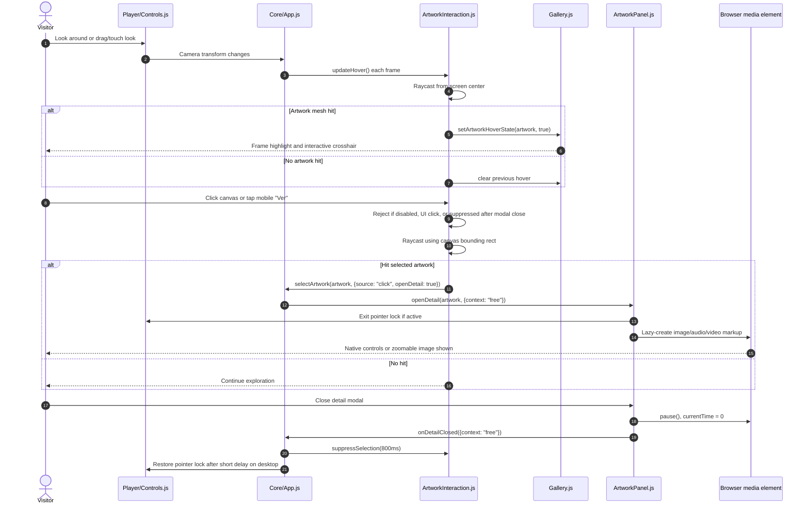

# Gallery And Artwork Model

## Purpose

The artwork model is the central domain model of the project. It is not only a display catalog; it controls spatial layout, media behavior, labels, lighting targets, guided-tour generation, and curatorial UI.

The current catalog lives in `src/data/artworks.json` and contains 29 artwork records. The model is intentionally flat JSON so it can be edited without a database or build step.

## Catalog Metrics

| Metric | Value |
|---|---:|
| Total artwork records | 29 |
| Main-wall records included in guided tour | 24 |
| Central/non-main-wall records | 5 |
| Curatorial rooms | 7 |
| Records with Cloudinary video | 29 |
| Records with audio guide | 1 |
| Featured records | 2 |
| Local image files | 27 |
| Local image payload | 9.96 MB |
| Distinct thematic tags | 26 |
| Distinct visual keywords | 33 |

## Spatial Distribution

The gallery uses a square wall convention around `x/z = +/-13.7`. Main-wall detection for the tour uses `WALL_EPSILON = 0.6` and `WALL_SPAN = 12.3`.

| Region | Count |
|---|---:|
| North/back wall | 6 |
| South/front wall | 6 |
| East wall | 6 |
| West wall | 6 |
| Central/non-tour region | 5 |

This distribution produces a balanced perimeter route while allowing central objects or special placements to exist outside the tour path.

## Artwork Record Contract

Common fields:

| Field | Type | Runtime consumers | Notes |
|---|---|---|---|
| `id` | string | Gallery, tour lookup, diagnostics | Must be unique and stable |
| `title` | string | Labels, panel, modal, tour HUD | Display title |
| `artist` | string | Labels, panel, modal | Current 3D labels show artist without year |
| `year` | string | Panel/modal metadata | Kept in catalog even if not shown in wall labels |
| `technique` | string | Labels, modal | Fallback exists in UI |
| `description` | string | Labels, panel, modal | Short text; label wraps to two lines |
| `image` | string | Gallery texture, modal image, video poster | Local asset path |
| `video` | string | Detail modal | Cloudinary URL in current catalog |
| `audio` | string | Detail modal | Optional; audio takes precedence over video |
| `position` | `[x,y,z]` | Gallery, lighting, tour | Three.js scene units |
| `rotation` | `[x,y,z]` | Gallery, lighting, tour normal | Euler radians |
| `size` | `[w,h]` | Gallery | Maximum display box before aspect-ratio fitting |
| `room` | string | Curatorial overlays, tour sorting | Maps to `Curatorial/rooms.js` |
| `featured` | boolean | Gallery frame sizing | Optional |
| `viewDistance` | number | Tour camera placement | Optional override |
| `cameraHeight` | number | Tour camera placement | Optional override |
| `curatorialText` | string | Tour/detail readings | Optional rich text |
| `formalReading` | string | Detail tabs | Optional |
| `symbolicReading` | string | Detail tabs | Optional |
| `interactionHint` | string | Proximity phrase/detail tab | Optional |
| `themes` | string[] | Ambient/proximity logic, research taxonomy | Optional |
| `visualKeywords` | string[] | Modal chips | Optional |

## Example Record

```json
{
  "id": "velitas",
  "title": "Velitas",
  "artist": "Byron Gálvez",
  "year": "2024",
  "technique": "Técnica mixta",
  "description": "Short curatorial description shown in labels and modals.",
  "image": "./src/assets/images/Velitas - Byron.jpg",
  "video": "https://res.cloudinary.com/.../Velitas_-_Byron.mp4",
  "position": [0, 2.2, 13.7],
  "rotation": [0, 3.1415926536, 0],
  "size": [2.2, 1.8],
  "room": "Mujeres, ritual y sensualidad",
  "themes": ["ritual", "luz", "memoria"],
  "visualKeywords": ["vela", "color", "materia"]
}
```

## Mesh Construction Pipeline

`Gallery.createRealisticArtwork(data)` performs the following pipeline:

1. Create `THREE.Group`.
2. Build fallback artwork group immediately.
3. Position and rotate group from JSON.
4. Add record to `this.artworks`.
5. Load image texture asynchronously.
6. Compute image aspect ratio from loaded texture.
7. Fit final display size inside configured `size`.
8. Clear fallback children.
9. Rebuild frame, backing, image plane, and label.
10. Notify app that shadows/raycast targets may need refresh.

The two-stage render avoids a blank scene while images load and makes aspect-ratio correction deterministic after texture metadata is available.

## Size Fitting

`fitArtworkSize(maxSize, imageAspectRatio)` preserves image proportions:

- landscape image: width = max width, height = width / aspect ratio;
- portrait/square image: height = max height, width = height * aspect ratio.

This treats `size` as a maximum display envelope, not as a forced stretch box.

## Frame And Label System

Each artwork group contains:

- an extruded frame built with `THREE.ExtrudeGeometry`;
- a dark backing board using `THREE.BoxGeometry`;
- a clickable image plane using `THREE.PlaneGeometry`;
- a wall label rendered into a 1024 x 460 canvas and converted to `THREE.CanvasTexture`.

Featured artworks use a larger frame width. Hover state modifies frame/backing material colors and is restored from stored original colors.

The current wall label hierarchy is:

1. title;
2. artist;
3. technique;
4. short description.

The catalog year remains available in side panel and detail modal metadata, but it is intentionally removed from in-scene wall labels to reduce visual noise.

## Raycast Contract

Only artwork image planes are used as selection targets. `Gallery` stores each clickable mesh in the artwork record, and `ArtworkInteraction.updateTargets()` receives that list after gallery setup.

The interaction layer assumes:

- each target has a mesh;
- mesh identity can be used to map ray hits back to artwork records;
- UI-originated clicks have `data-ui-interactive="true"` somewhere in their ancestor chain;
- pointer-lock selection uses center screen;
- unlocked selection uses renderer canvas bounds.

## Guided Tour Coupling

`tourPath.js` consumes the same artwork records. The path generator does not hard-code the route. Instead, it:

1. filters records near main walls;
2. prioritizes `byron-galvez`;
3. sorts by room rank;
4. sorts by clockwise wall position within a room;
5. computes camera positions from artwork wall normals.

This means changes to `position`, `rotation`, `room`, `viewDistance`, or `cameraHeight` directly affect guided-tour behavior.

## Validation

`scripts/validate-artworks.js` currently checks:

- file exists and parses;
- catalog is a non-empty array;
- required fields are present;
- duplicate ids are rejected;
- `position` and `size` are numeric arrays;
- optional `rotation` is numeric when present;
- local image/audio/video assets exist;
- remote media URLs parse as valid URLs.

Future validation should add:

- allowed room names;
- allowed field types for curatorial arrays;
- check that main-wall rotations face inward;
- check that every Cloudinary URL uses approved delivery transformations;
- report unreferenced local assets.

## Data Governance

Because content and spatial logic share the same JSON file, catalog edits should follow a review checklist:

1. Run `node scripts/validate-artworks.js`.
2. Confirm image exists and is appropriately compressed.
3. Confirm wall placement and rotation in browser.
4. Confirm label text is readable from normal viewing distance.
5. Confirm guided-tour stop and look direction if artwork is on a main wall.
6. Confirm modal content, video, audio, and close behavior.

## Interaction Diagram

Diagram source: [`diagrams/artwork-interaction-flow.mmd`](diagrams/artwork-interaction-flow.mmd).



