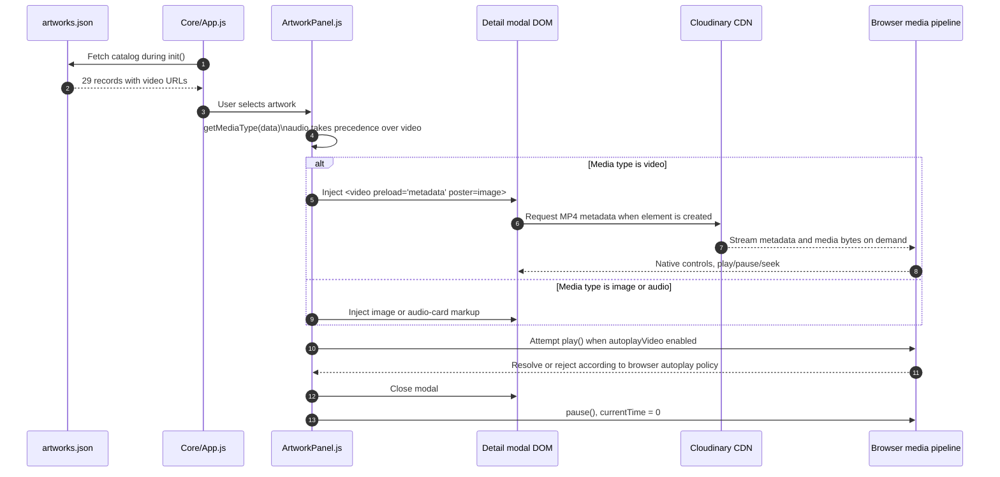

# Cloudinary Video Integration

## Motivation

Artwork videos are intentionally kept outside the repository. The project is deployed as static files, so committing large MP4 files would increase clone time, repository history size, review friction, and GitHub Pages delivery weight. Cloudinary is used as an external media delivery layer while the repository retains only URLs in `src/data/artworks.json`.

## Current Inventory

| Metric | Value |
|---|---:|
| Artwork records | 29 |
| Records with `video` URL | 29 |
| Records using Cloudinary URL | 29 |
| Local committed video files | 0 |
| Records with local audio guide | 1 |

## Runtime Flow

The application does not instantiate video elements during startup. It only fetches the JSON catalog and preloads local images. Video markup is created lazily inside `ArtworkPanel.openDetail()` when the visitor opens an artwork whose selected media type is video.

Current media priority:

1. audio;
2. video;
3. image.

This priority means an artwork with both `audio` and `video` is presented as an audio-card first.

## Implementation Details

`ArtworkPanel.createVideoMarkup(data)` creates:

```html
<video
  class="artwork-detail__video"
  controls
  playsinline
  preload="metadata"
  poster="local artwork image"
>
  <source src="Cloudinary MP4 URL" type="video/mp4">
</video>
```

Design consequences:

- `preload="metadata"` avoids eager full download.
- `playsinline` improves mobile behavior.
- poster uses the local artwork image, avoiding an extra thumbnail asset.
- native controls reduce custom media-control complexity.
- Cloudinary traffic begins only when the modal injects the video node.

## Lifecycle

Diagram source: [`diagrams/cloudinary-video-flow.mmd`](diagrams/cloudinary-video-flow.mmd).



## Current Cleanup

`ArtworkPanel.stopDetailMedia(modal)` currently:

- pauses each `video` and `audio`;
- resets `currentTime` to `0`.

This is correct for user-visible state. It is not the strongest possible memory/network cleanup because the media source remains attached until the modal content is replaced or garbage-collected.

Recommended hardening:

```js
media.pause();
media.removeAttribute('src');
media.querySelectorAll('source').forEach((source) => source.removeAttribute('src'));
media.load();
```

This would be most valuable on mobile devices and long sessions with many modal openings.

## Cloudinary URL Strategy

The current catalog stores direct MP4 delivery URLs. A stronger delivery strategy would standardize transformations, for example:

```text
q_auto,f_auto,w_1280
```

Recommended policy:

| Use case | Suggested transformation | Rationale |
|---|---|---|
| Desktop modal | `q_auto,f_auto,w_1280` | Strong quality/performance balance |
| Mobile modal | `q_auto,f_auto,w_854` | Lower bandwidth and decode cost |
| Thumbnail/poster | local artwork image or generated JPG/WebP | Avoid video metadata fetch for poster |
| Slow network fallback | image-only mode | Preserve curatorial access without video |

## Measurement Plan

Video integration should be evaluated with repeatable metrics:

| Metric | How to measure | Target |
|---|---|---|
| Time to metadata | Modal open to `loadedmetadata` | Under 1.5s on stable broadband |
| Time to first frame | Modal open to `loadeddata` or first visual frame | Under 2.5s on stable broadband |
| Bytes transferred before play | DevTools Network | Metadata only before user playback |
| Memory after close | Browser task manager or performance panel | No unbounded growth after repeated opens |
| Mobile playback | Manual QA on iOS/Android | Inline playback works, controls usable |

## Risks

- Remote URL availability is outside repository control.
- Browser autoplay policies may reject `play()` despite user intent.
- Unoptimized MP4 dimensions may increase decode cost.
- Cloudinary transformations are not yet normalized in the catalog.
- Current cleanup pauses media but does not explicitly detach sources.

## Engineering Decision

Keeping videos remote and lazy-created is the correct architecture for this static museum. The next engineering step is not to move videos into the repo; it is to formalize URL transformations, add stronger cleanup, and add network/media timing checks to manual QA.

