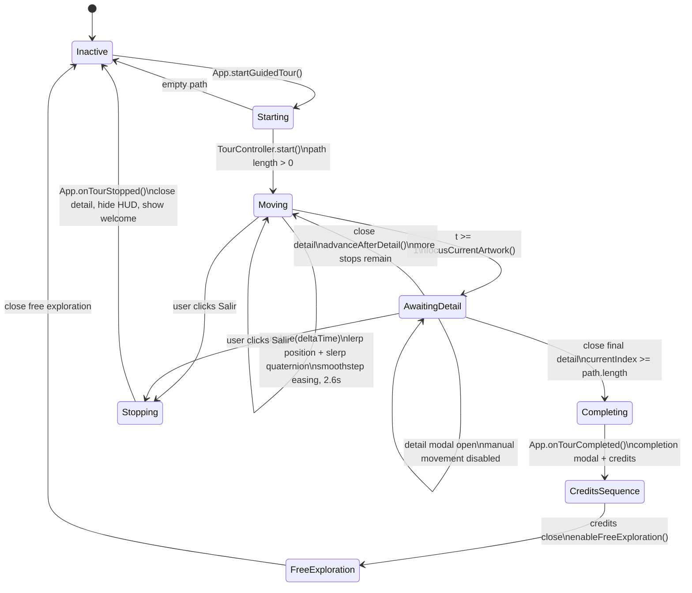

# Guided Tour

## Purpose

The guided tour is a metadata-driven camera route through the museum. It transforms the artwork catalog into an ordered interpretive path, moves the camera automatically, presents the current artwork, waits for the visitor to close the detail view, and then advances.

The design goal is to provide a curated reading without duplicating route data by hand.

## Current Route Metrics

| Metric | Value |
|---|---:|
| Total artwork records | 29 |
| Generated guided-tour stops | 24 |
| Non-main-wall records excluded from tour | 5 |
| Curatorial rooms in route | 7 |
| Movement duration per stop | 2.6 seconds |
| Default camera height | 1.7 scene units |
| Default view distance | 5.15 scene units |

Stops by room:

| Room | Stops |
|---|---:|
| Una obra que nos permite recuperar lo sagrado | 1 |
| Abstracción y figuración | 4 |
| Color, textura y profundidad | 3 |
| Mujeres, ritual y sensualidad | 6 |
| Luz y lo invisible | 4 |
| Paisaje y espacio interior | 2 |
| La tecnología como recurso curatorial | 4 |

## Route Generation

`src/js/modules/Tour/tourPath.js` implements the route generator. It avoids a static hard-coded path and instead computes route stops from artwork records.

Main-wall inclusion:

```text
WALL_POSITION = 13.7
WALL_EPSILON = 0.6
WALL_SPAN = 12.3
```

An artwork is included if it is close to a perimeter wall and within the accepted wall span. Central or freestanding placements remain visible in free exploration but are excluded from the guided tour.

Sorting logic:

1. prioritize `byron-galvez` when present;
2. sort by curatorial room rank from `Curatorial/rooms.js`;
3. sort clockwise within the room and wall coordinate system.

## Camera Stop Calculation

For each included artwork:

```js
normalX = Math.sin(rotationY)
normalZ = Math.cos(rotationY)
cameraPosition = [
  artwork.x + normalX * viewDistance,
  artwork.cameraHeight || 1.7,
  artwork.z + normalZ * viewDistance
]
lookAt = artwork.position
```

This makes camera placement depend on the artwork wall normal. If a curator changes a painting's rotation, the tour view position follows the new orientation.

## State Machine

`TourController` uses a small explicit state model:

| State | Meaning |
|---|---|
| `idle` | Tour inactive |
| `moving` | Camera interpolating toward current stop |
| `awaiting-detail` | Camera reached artwork; app waits for modal close |
| `complete` | Final stop closed; app handles completion sequence |

Diagram source: [`diagrams/guided-tour-flow.mmd`](diagrams/guided-tour-flow.mmd).



## Camera Interpolation

Movement uses:

- `Vector3.lerpVectors()` for camera position;
- `Quaternion.slerp()` for camera orientation;
- smoothstep easing `t * t * (3 - 2 * t)`;
- duration `2.6` seconds.

Slerp is important because camera rotation should not linearly interpolate Euler angles. Quaternion interpolation avoids visible rotational artifacts and keeps the camera turn smooth.

## UI Behavior

The tour HUD displays:

- topbar with exit button;
- current room;
- progress text (`current of total`);
- progress bar;
- curatorial text for the current stop.

Manual controls and pointer lock are disabled during guided tour mode. When the visitor exits manually, `App.onTourStopped()` closes any detail view, hides tour UI, disables free exploration, and returns to the welcome overlay.

## Completion Sequence

After the final artwork detail closes:

1. `TourController.complete()` marks the tour complete.
2. `App.onTourCompleted()` hides artwork UI and disables interaction.
3. A completion modal appears briefly.
4. Credits modal opens.
5. When credits close, the app can return the visitor to free exploration.

## Engineering Notes

- The route is deterministic for a given catalog.
- Adding wall artworks can automatically add tour stops.
- Incorrect `position` or `rotation` values can create bad camera stops, so spatial QA is required after catalog edits.
- The tour currently waits on modal close rather than advancing on a timer, which respects visitor reading pace.

